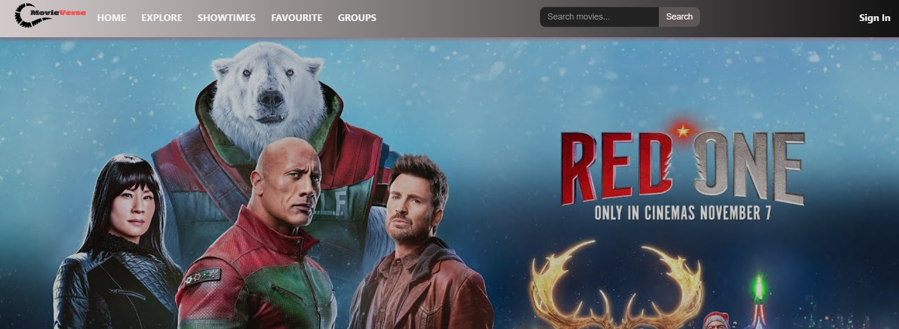
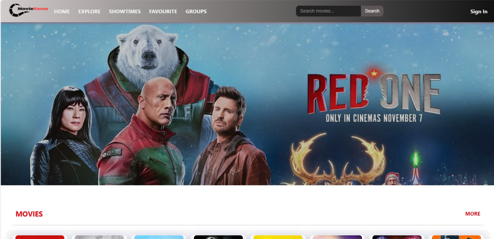
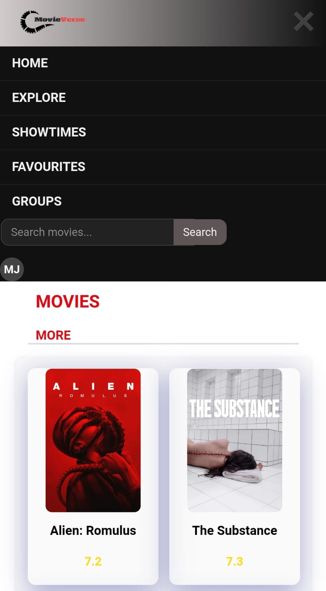
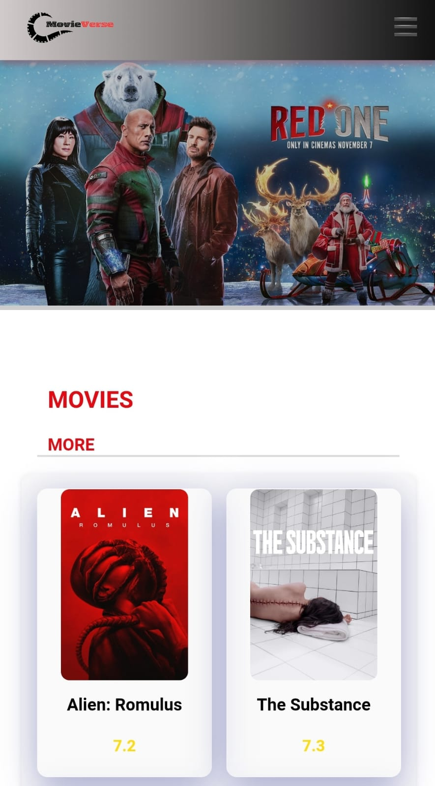

# 🎬 **MovieVerse**

## Table of Contents
1. About
2. Key Features
3. Technologies Used
4. Project Team Members
5. Database Structure
6. Interface Description
7. Getting Started
8. Website Link
9. 

---

## 📖 About

**MovieVerse** is a website created for movie enthusiasts, offering tools to explore, rate, review, and discover movies. Whether you’re a casual viewer or a die-hard movie fan, you’ll find features designed to enhance your entertainment experience.

---

## ⭐ Key Features

### Extensive Database
Browse a wide catalog of movies, each with:
- **Description**
- **Rating**
- **Trailer**
- **Cast Details**
- **User Reviews**

Check movie showtimes in cinemas in Finland.

### User Profiles
- **Rate and review** movies.
- **Create favorites lists** and share them.
- **Join groups** of movie enthusiasts with similar interests.

---

## 🛠️ Technologies Used

- **Frontend:** React
- **Backend:** Node.js, Express
- **Database:** PostgreSQL
- **APIs:** TMDB, Finnkino

---

## 👥 Project Team Members

- **Congying Zhao**: Homepage, showtimes page, group management, reviews
- **Anna Kasprzak**: Database structure, search functionality
- **Sandip Bade**: Explore page, group feature
- **Manjula Karunanayaka**: Favorites, add reviews, movie details page, website Responsiveness, static pages.
- **Shankar Jaiswal**: Website template, account management

---

## 🗄️ Database Structure

- **Account**: Stores user credentials and profile information.
- **Review**: Links user reviews to movies.
- **Favourite**: Tracks users' favorite movies.
- **Group Member**: Manages group memberships.
- **Movie Group**: Stores information about user-created groups.
- **Group Post**: Holds posts within groups.
- **Notification**: Manages notifications for group join requests.

---

## 🖥️ Interface Description

- **Homepage**: Displays trending movies, search bar, quick links, and user reviews.
- **Search Results**: Lists search results with thumbnails, ratings, and more details.
- **Movie Details Page**: Shows full details, trailer, cast, and user reviews.
- **User Profile**: Manage account settings.
- **Groups Page**: View, manage, and create groups.
- **Review Section**: Browse, sort, like, and share reviews.
  
- **Responsiveness**:

Desktop View

Mobile View

  
  

---

## 🚀 Getting Started

### Prerequisites
- **Node.js**
- **Git**
- **npm**

### Installation

Clone the repository:

git clone https://github.com/MovieVerse-2024Autumn/MovieVerse-AWAP-Repo-2024Autumn 

cd movieverse-backend

npm install

npm devStart

### 🌐 Website Link

- **Frontend**: https://mango-moss-05ef74d10.4.azurestaticapps.net
- **Backend**: https://movieverse-backend-8oqu.onrender.com

